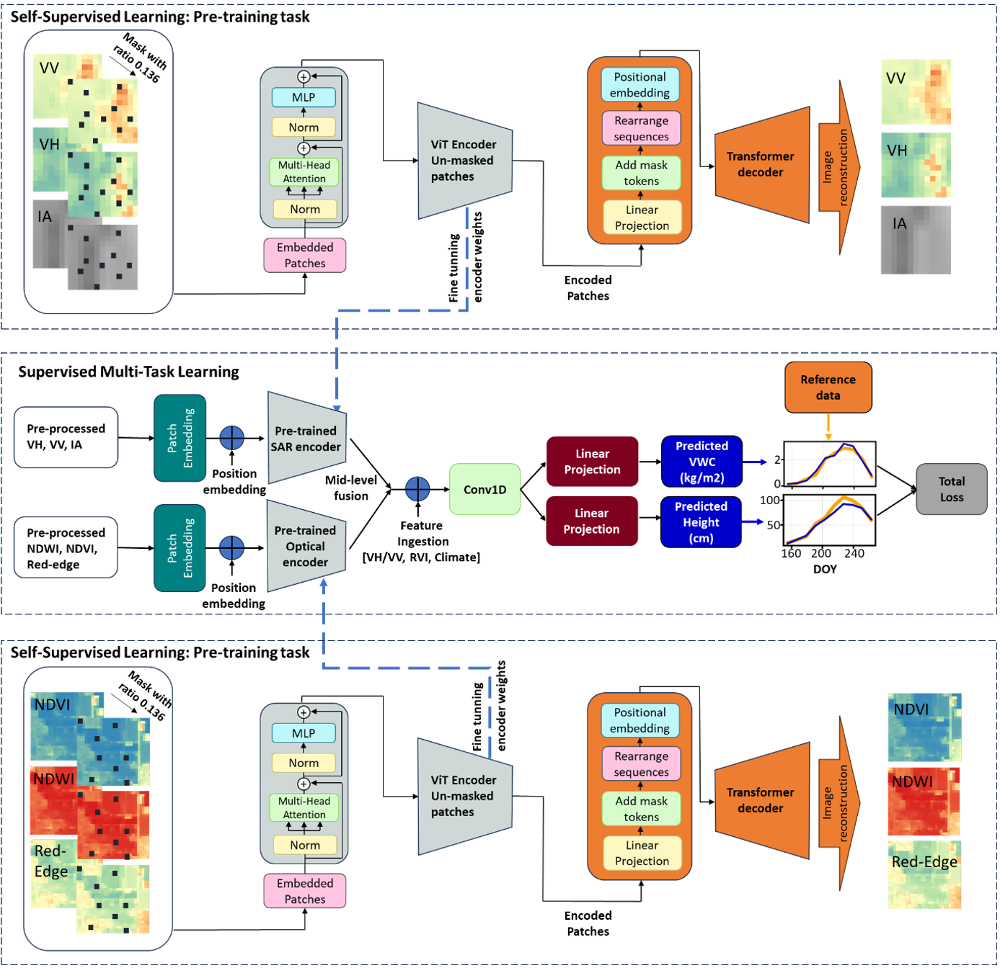

# Estimating Crop Biophysical Parameters using Self-Supervised Learning with Geospatial Foundation Models

[](https://www.python.org/downloads/)
[](https://pytorch.org/)

This repository contains the implementation of geospatial foundation models for estimating **Vegetation Water Content (VWC)** and **crop height** using self-supervised learning with Sentinel-1A SAR and Sentinel-2 optical data.



## **Repository Structure**

```
├── ML/                           
│   ├── VWC.py            
│   ├── Height.py                  
├── SSL/          
│   ├── SSL_FM_optical.py                
│   ├── SSL_FM_SAR.py                 
│   └── model_utils.py           
├── Supervised Learning/                          
│   ├── MTL.py          
│   ├── STL_height.py        
│   └── STL_VWC.py    
          
```

## **Model Architecture & Hyperparameters**

### Self-Supervised Learning (SSL) Configuration

**Masked Autoencoder (MAE) Settings:**
```yaml
# SSL Hyperparameters
patch_size: 256
encoder_dim: 768
encoder_layers: 12
attention_heads: 16
decoder_dim: 512
decoder_layers: 1
learning_rate: 6.777e-05
batch_size: 16
mask_ratio: 0.136
epochs: 50
```

**Training Data:**
- **Dataset Size**: 4,000 patches per modality (SAR/Optical)
- **Patch Dimensions**: 256×256×3 channels
- **Total Pixels**: ~262 million pixels for training

### Supervised Learning Configuration

**Foundation Model Settings:**
```yaml
# Supervised Learning Hyperparameters
learning_rate: 0.00024
patch_size: 8
batch_size: 8
patience_early_stopping: 13
conv1d_layers: 1
conv1d_size: 1024
dropout_rate: 0.136
weight_decay: 2.95e-05
lr_cosine_init: 0.00999
lr_cosine_cycles: 4
```

**Model Architecture:**
- **Encoder**: Pre-trained ViT (Vision Transformer)
- **Temporal Module**: 1D Convolutional layer
- **Fusion Strategy**: Mid-level concatenation
- **Output Layers**: Linear projection for VWC/height estimation

## **Installation & Setup**

### Dependencies
```bash
pip install torch>=1.12.0
pip install torchvision>=0.13.0
pip install numpy>=1.21.0
pip install xarray>=0.20.0
pip install rasterio>=1.3.0
pip install scikit-learn>=1.1.0
pip install shap>=0.41.0
pip install pandas>=1.4.0
pip install matplotlib>=3.5.0
```

### Traditional Machine Learning

**Random Forest:**
```python
python ML/random_forest.py \
    --features VH,VV,NDVI,NDWI,climate \
    --target vwc \
    --cv_folds 10 \
    --n_estimators 100
```

**XGBoost:**
```python
python ML/xgboost_model.py \
    --features VH,VV,NDVI,NDWI,climate \
    --target vwc \
    --cv_folds 10 \
    --max_depth 6
```

## **Input Features Configuration**

### SAR Features (Sentinel-1A)
```python
sar_features = {
    'VH': 'VH backscatter coefficient',
    'VV': 'VV backscatter coefficient', 
    'VH_VV_ratio': 'VH/VV ratio',
    'RVI': 'Radar Vegetation Index',
    'incidence_angle': 'SAR incidence angle'
}
```

### Optical Features (Sentinel-2)
```python
optical_features = {
    'NDVI': 'Normalized Difference Vegetation Index',
    'NDWI': 'Normalized Difference Water Index (Green-NIR)',
    'red_edge': 'Red-edge reflectance (Band 7)'
}
```

### Climate Features
```python
climate_features = {
    'accumulated_precipitation': 'Total rainfall from planting date',
    'min_temperature': 'Average minimum temperature',
    'max_temperature': 'Average maximum temperature'
}
```

## **Model Training Configuration**

### Data Split Strategy
```python
# Pixel-wise split
train_pixels = 0.7  # 70% for training
val_pixels = 0.15   # 15% for validation  
test_pixels = 0.15  # 15% for testing

# Cross-validation
cv_folds = 10
```

### Optimization Settings
```python
optimizer_config = {
    'optimizer': 'Adam',
    'scheduler': 'CosineAnnealingLR',
    'early_stopping': True,
    'patience': 13,
    'loss_function': 'MSE'
}
```

## **Model Evaluation**

**Performance Metrics:**
- R² (Coefficient of Determination)
- MAE (Mean Absolute Error)
- RMSE (Root Mean Square Error)


## **Pre-trained Models**

The repository includes pre-trained encoders:
- `sar_encoder.pth`: SAR encoder weights (15M parameters)
- `optical_encoder.pth`: Optical encoder weights (15M parameters)

**Loading Pre-trained Models:**
```python
import torch
from model_utils import load_pretrained_encoder

# Load SAR encoder
sar_encoder = load_pretrained_encoder(
    './pretrained_models/sar_encoder.pth',
    input_channels=3,
    patch_size=256
)

# Load Optical encoder  
optical_encoder = load_pretrained_encoder(
    './pretrained_models/optical_encoder.pth',
    input_channels=3,
    patch_size=256
)
```

## **Citation**

